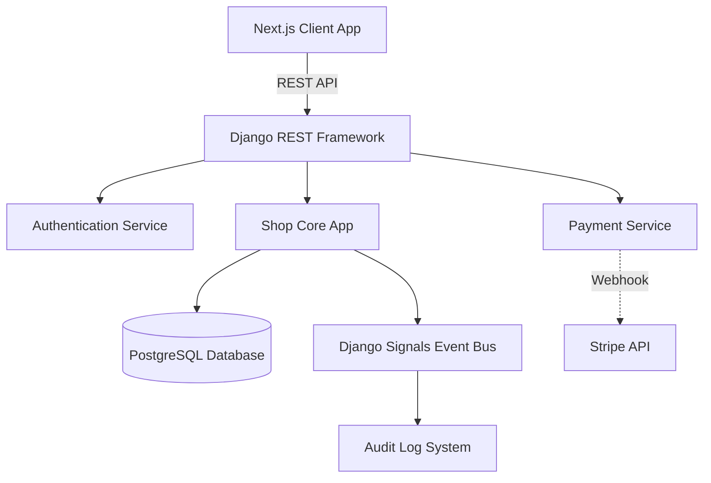

# Printsy System Architecture

This document outlines the architectural decisions and design patterns implemented in the Printsy project, adhering to SOLID principles and modern web development standards.

## High-Level Architecture

Printsy employs a decoupled **Client-Server Architecture**, separating the presentation layer from the business logic layer.

## SOLID Principles in Practice

1.  **Single Responsibility Principle (SRP)**: Controllers (`views.py`) are strictly responsible for HTTP request/response routing. Complex object creation logic has been abstracted to `OrderFactory`, and payment logic to `PaymentStrategy`.
2.  **Open/Closed Principle (OCP)**: The `PaymentStrategy` interface allows us to introduce new payment gateways (e.g., PayPal, GCash Direct) without modifying the existing `OrderViewSet` code.
3.  **Liskov Substitution Principle (LSP)**: Any subclass of `PaymentStrategy` (e.g., `StripePaymentStrategy`, `ManualPaymentStrategy`) can be used interchangeably by the `PaymentContext`.
4.  **Interface Segregation Principle (ISP)**: API endpoints are decoupled and provide only the data required by specific frontend components (e.g., fetching variants independently of the full product payload).
5.  **Dependency Inversion Principle (DIP)**: High-level modules (like the API views) depend on abstractions (`PaymentStrategy`) rather than concrete implementations (Stripe library directly in the view).

## Integrated Design Patterns

### 1. Strategy Pattern
**Location:** `backend/shop/patterns.py`

**Purpose:** To encapsulate algorithms for payment processing. This allows the system to easily switch between automated gateways (Stripe) and manual processing (OTC/Bank Transfer) at runtime.

### 2. Factory Pattern
**Location:** `backend/shop/patterns.py`

**Purpose:** The `OrderFactory` encapsulates the complex instantiation logic of an `Order` and its calculated properties (e.g., dynamically computing the total cart amount based on variant prices), keeping the controller clean.

### 3. Observer Pattern (Event-Driven Architecture)
**Location:** `backend/shop/signals.py`

**Purpose:** Using Django Signals as an event bus, the `AuditLog` automatically observes changes to the `Order` model's status. When an order transitions from 'pending' to 'paid', the Observer automatically generates a timestamped audit trail without tightly coupling the logging logic to the payment views.

## Standout Architectural Features

- **Feature Toggles**: Dynamic database flags (`FeatureToggle` model) allow administrators to enable/disable features like "Express Delivery" in real-time without deploying new code.
- **Event-Driven Audit Logging**: Complete transparency and history tracking using the Observer pattern.
