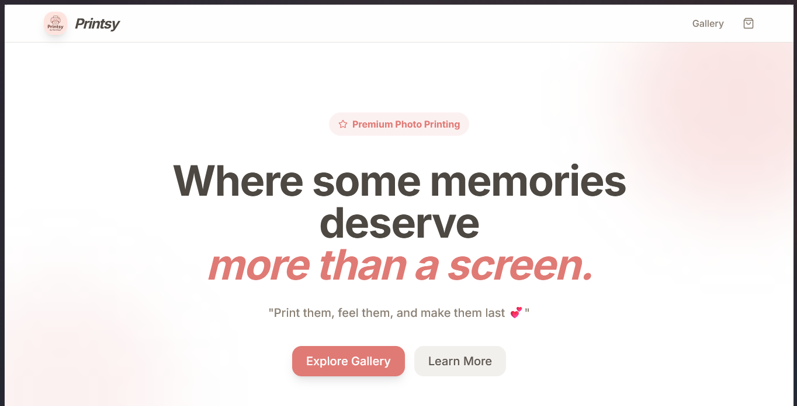

# 📸 Printsy

"Where some memories deserve more than a screen. Print them, feel them, and make them last 💕"

Printsy is a specialized photo printing platform built with Next.js and Django. It allows users to upload high-quality photos, select custom sizes, and order professional prints with ease.

## 🧱 Tech Stack

| Layer | Technology |
|-------|------------|
| Backend | Django 5.x + Django REST Framework |
| Frontend | Next.js 15 (App Router) + TypeScript + Tailwind CSS |
| Database | SQLite (Dev) / PostgreSQL (Prod) |
| Payments | Stripe Checkout (GCash supported) |
| Image Processing | Pillow |

## 🚀 Key Features

- **Specialized Photo Editor**: Simplified upload and preview system for photo prints.
- **Dynamic Sizing**: Support for various dimensions (2x3, 4R, 5R, 8R, A4).
- **Premium Aesthetics**: Clean, modern UI with a focus on photography.
- **Secure Payments**: Integrated with Stripe for cards and local Philippine payment methods like GCash.

## 🎬 Demo

[📹 Watch Demo Video](assets/Printsy_demo.mp4)

## 📍 Contact
Based in Surigao City.
Facebook: Printsy
💕

